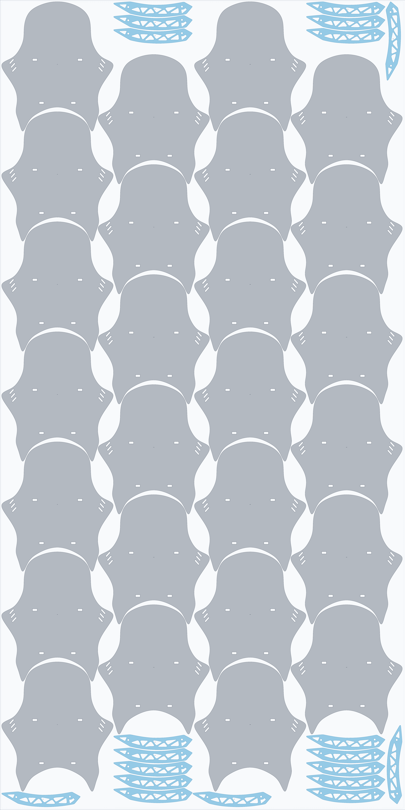

# CDR to SVG Converter & Geometry Enhancer (EasyNest v2)

A Python tool that converts CorelDRAW (`.cdr`) drawings into clean, enhanced SVG files. It detects and repairs edge gaps (open/disconnected lines) and reconstructs the geometry into **perfectly isolated objects with internal holes (cutouts/voids) isolated**.

---

## 🛠️ How It Works

1. **CDR to SVG Conversion**: Invokes LibreOffice headless engine (`libcdr`) to extract native vector paths from CorelDRAW files.
2. **Path Cleaning**: Strips out LibreOffice metadata, presentation slides, bullet character definitions (`defs`), and invisible bounding boxes.
3. **Edge Gap & Disconnected Line Repair**:
   - Detects open curve paths where the endpoint does not meet the starting point.
   - Automatically bridges gaps and stitches adjacent curve segments within a configurable tolerance.
   - Smoothly closes loops with exact cubic Bezier curvature preservation.
4. **Topological Hierarchy & Hole Isolation (Shapely)**:
   - Evaluates polygon containment (`parent.contains(child)`).
   - Classifies Level 0 boundaries as **Outer Part Shells**.
   - Classifies Level 1 internal cutouts (screw holes, decorative slots, vents) as **Holes**.
5. **Output Generation**:
   - Generates a clean SVG with a single compound path using `fill-rule="evenodd"`.
   - Supports nesting mode (`--mode compound`, `nested`, or `both`) with distinct layers for outer perimeters and hole cutouts.
   - Snugly crops the viewBox with customizable padding around the object.
   - Generates high-resolution PNG visual preview side-by-side.

---

## 🚀 Quick Start

### Basic CLI Usage

```bash
# Convert and enhance sample CDR
python3 cdr_enhancer.py "GAR TURBO D.cdr"

# Convert another file
python3 cdr_enhancer.py "GAR NMAX NEW G.cdr"
```

Output files created:
- `GAR TURBO D_enhanced.svg` — Production-ready vector file.
- `GAR TURBO D_enhanced_preview.png` — Rendered preview for visual inspection.

### Options & Flags

| Flag | Default | Description |
|------|---------|-------------|
| `-o`, `--output` | `<input>_enhanced.svg` | Custom output SVG file path |
| `-t`, `--tolerance` | `300.0` (~3 mm) | Maximum gap distance to bridge disconnected lines |
| `-p`, `--padding` | `400.0` (4 mm) | Padding around viewBox border |
| `--mode` | `compound` | SVG format: `compound` (`evenodd`), `nested` (separate hole layers), or `both` |
| `--fill` | `#6366f1` | Color for solid part body |
| `--opacity` | `0.35` | Fill opacity |
| `--stroke` | `#4338ca` | Outline stroke color |
| `--stroke-width` | `25.0` (0.25 mm) | Stroke thickness |
| `--no-preview` | False | Skip PNG preview generation |
| `--no-normalize` | False | Preserve original document coordinate space |

### Python API Integration

```python
from cdr_enhancer import process_file

result = process_file(
    input_path="GAR TURBO D.cdr",
    output_svg_path="output.svg",
    tolerance=300.0,
    mode="compound"
)

print(f"Isolated objects: {result['isolated_objects_count']}")
print(f"Total holes: {result['total_holes_count']}")
print(f"Repaired gaps: {result['open_lines_repaired']}")
```

---

## 🏭 Industrial True-Shape Nesting CLI (`industrial_nest.py`)

A production-grade 2D irregular nesting tool designed for CNC laser cutting, routers, and plotters. It features multi-strategy tournament optimization (concentric curve-hugging lattice, true-shape BLF, and boundary strip void filling) to achieve **the highest possible sheet yield (max fit)** with adjustable kerf.

### CLI Usage

```bash
# Nest on a custom sheet (e.g. 500x300 mm) with 2mm kerf
python3 industrial_nest.py "GAR TURBO D.cdr" --sheet 500x300 --kerf 2.0 --margin 5.0

# Nest on a standard 4x8 ft sheet (122x244 cm)
python3 industrial_nest.py "GAR TURBO D.cdr" --sheet "122x244cm" --kerf 2.0 --margin 5.0
```

### Options & Flags

| Flag | Default | Description |
|------|---------|-------------|
| `-s`, `--sheet` | *(Required)* | Sheet size in `WxH` (e.g. `500x300`, `122x244cm`, `2440x1220`) |
| `-k`, `--kerf` | `2.0` (mm) | Tool cutting kerf / part-to-part safety gap |
| `-m`, `--margin` | `5.0` (mm) | Border margin from sheet edges |
| `-r`, `--rotations` | `4` | Allowed rotations: `2` (0,180°), `4` (0,90,180,270°), `free` (15° step) |
| `-o`, `--output` | Auto | Output nested SVG file path |
| `--no-preview` | False | Skip PNG preview rendering |

### Benchmark Results on `GAR TURBO D`

| Layout Sheet | Dimensions | Kerf | Margin | Units Nested | Material Yield | Cut Length |
|--------------|------------|------|--------|--------------|----------------|------------|
| Small Sheet  | 500 x 300 mm | 2.0 mm | 5.0 mm | **14 parts** (Max Fit) | **68.88%** | 15.68 m |
| Full 4x8 ft  | 122 x 244 cm | 2.0 mm | 5.0 mm | **305 parts** (Max Fit) | **75.62%** | 341.51 m |

---

## 🧬 Superposition Multi-Universe Concurrent Mixed Nesting

When nesting multiple part types simultaneously (e.g. large primary parts like `windshield.svg` mixed with smaller filler parts like `GAR TURBO D.cdr`), the engine activates **Superposition Mode**:

1. **Multi-Universe Concurrency (`multiprocessing`)**:
   - Concurrently spawns and evaluates competing candidate layout universes across all CPU cores in parallel:
     - **Universe 1**: Honeycomb Staggered Interlock (4 columns of primary parts nested horizontally).
     - **Universe 2**: Compact Left-Biased Layout (3 columns packed left, leaving an open 200 mm secondary corridor).
     - **Universe 3**: Centered Balanced Layout (symmetric dual corridors).
     - **Universe 4**: Zero-Drift Cluster Tessellation.
2. **Recursive Multi-Wave Void Filler**:
   - Wave 1: Edge Corridor & Margin Micro-Scan (top/bottom margins and lateral strips).
   - Wave 2: Inter-Column Bay & Waist Recess Inundation.
   - Wave 3: Boundary Anchor Multi-Angle Probing (16–24 angles with strict zero collision).
3. **Evolutionary Selection & Tournament Scoreboard**:
   - Scores each universe based on net part area, material yield %, and total part count.
   - Automatically crowns the fittest champion universe and exports the production SVG and PNG preview.

### Mixed Nesting Benchmark (122 x 244 cm Sheet)

```bash
python3 industrial_nest.py windshield.svg "GAR TURBO D.cdr" \
  --sheet "122x244cm" --kerf 2.0 --margin 5.0 --sheet-cost 35.0 --machine-rate 75.0
```

| Strategy / Universe | Windshields | GAR TURBO D | Total Parts | Material Yield | Cut Length | Unit Cost ($) | Solve Time |
| :--- | :---: | :---: | :---: | :---: | :---: | :---: | :---: |
| **Honeycomb Staggered (Champion)** | **26 units** | **20 units** | **46 units** | **75.41%** | **66.75 m** | **$1.495** | **19.17s** |
| Centered Balanced | 21 units | 50 units | 71 units | 69.30% | 91.81 m | $1.161 | 15.62s |
| Compact Left-Biased | 21 units | 35 units | 56 units | 65.58% | 75.01 m | $1.296 | 10.98s |
| Zero-Drift Cluster | 21 units | 35 units | 56 units | 65.58% | 75.01 m | $1.314 | 11.67s |

<p align="center">
  
  <br/>
  <em>Figure: Production Max-Fit Nested 122 x 244 cm Sheet (26 Windshields + 20 GAR TURBO D, 2.0 mm kerf, zero collisions, all internal holes preserved).</em>
</p>

---

## 🧠 TypeSafe Jev System One AI Intelligence Integration

EasyNest v2 integrates **TypeSafe's Jev Foundation Model** ([docs.typesafe.ai](https://docs.typesafe.ai)) for sub-50ms calibrated industrial judgments across 5 core pillars where deterministic algorithms fall short:

### The 5 Active Jev Pillars:

1. **Pillar 1: Semantic Shape Mating & Affinity Guidance**
   - Deterministic nesting sorts blindly by descending area ($O(N!)$ misses).
   - Jev evaluates topological curvature, aspect ratios, concavity depths, and complementary voids before running the tournament.
   - Recommends the optimal tessellation strategy (e.g. *Honeycomb Staggered* vs *Compact Corridor*) and twin-block clustering.

2. **Pillar 2: Shop Floor Economics & Machine TCO (True Cost per Part)**
   - Deterministic nesting only optimizes for raw geometric Scrap %.
   - Jev factors in true shop floor economics:
     $$\text{Total Cost} = \text{Sheet Material } \$ + \text{Laser Beam Time } \$ + \text{Piercing Wear } \$ - \text{Remnant Salvage } \$$$
     $$\text{Unit Cost} = \frac{\text{Total Cost}}{\text{Total Finished Parts}}$$
   - Evaluates whether squeezing in extra parts is worth the additional laser beam run time on expensive machines ($75/hr+).
   - Crowns the **Jev Economic Champion**.

3. **Pillar 3: Thermal Distortion & Lead-In Piercing Defense**
   - Tight kerfs (e.g. 2.0 mm) on thin materials can cause thermal distortion, burn-through, or tip-up collisions with cutouts.
   - Jev assesses material type (Cast Acrylic, Stainless, Aluminum, Mild Steel) and bridge gaps to recommend assist gas protocols and CAM path interleaving.

4. **Pillar 4: Remnant Off-Cut Sheet Portfolio Allocation**
   - Analyzes residual scrap geometry and corridor widths.
   - Classifies off-cuts into *Reusable Prime Strip*, *Secondary Hobby Stock*, or *Unrecoverable Scrap*.
   - Calculates salvage value to credit back into the manufacturing ledger.

5. **Pillar 5: Semantic CAD Geometry Intent Classification**
   - Classifies vector paths in CAD/CDR files into functional categories: `outer_boundary`, `mounting_aperture`, `decorative_vent`, or `cad_artifact` (stray marks or accidental duplicates).
   - Prevents corrupted nests by validating production readiness.

### Economic & TCO CLI Flags

```bash
python3 industrial_nest.py windshield.svg "GAR TURBO D.cdr" \
  --sheet "122x244cm" \
  --kerf 2.0 \
  --margin 5.0 \
  --sheet-cost 35.0 \
  --machine-rate 75.0 \
  --material "3mm Cast Acrylic"
```

| Flag | Default | Description |
|------|---------|-------------|
| `--sheet-cost` | `35.0` ($) | Raw sheet material cost in USD |
| `--machine-rate` | `75.0` ($/hr) | CNC laser / router hourly rate |
| `--material` | `"3mm Cast Acrylic"` | Material description for thermal & assist gas advice |
| `--typesafe-key` | Env `TYPESAFE_API_KEY` | Custom TypeSafe API key |
| `--no-jev` | `False` | Disable Jev AI advisory engine |

---

## 🏍️ Realistic Motorcycle Parts CAD Library (`parts/`)

EasyNest v2 includes a parametric library of 12 realistic CAD motorcycle components (`generate_parts.py`) spanning three production tiers with genuine industrial geometry: curvature blends, mounting apertures, lightening pockets, and cooling louvers.

| Tier | Part ID & Filename | Description | Dimensions (mm) | Features & Holes |
|:---|:---|:---|:---|:---|
| **Tier A (Large Panels)** | `p01_front_fairing.svg` | Aerodynamic front cowl panel | 520.0 × 341.7 mm | 5 holes (M8 mounts + central headlight aperture) |
| | `p02_rear_tail_hugger.svg` | Curved rear tire hugger / fender | 454.3 × 242.5 mm | Deep concave tire arch void + 2 bracket mounts |
| | `p03_radiator_shroud.svg` | Angled airflow radiator duct | 430.0 × 260.0 mm | 3 cooling louvers + 3 chassis mounting holes |
| | `p04_engine_skid_plate.svg` | Heavy-duty sump protection plate | 380.0 × 310.0 mm | Sump drain port + 8 ventilation slots/holes |
| **Tier B (Medium Brackets)** | `p05_tail_tidy_bracket.svg` | License plate & turn signal bracket | 280.0 × 190.0 mm | 5 holes (wiring pass-through + signal tabs) |
| | `p06_rearset_footpeg_hanger.svg` | CNC foot control hanger bracket | 240.0 × 160.0 mm | 6 holes (pivot bore + 4-position adjustment slots) |
| | `p07_exhaust_heat_shield.svg` | Curved silencer heat guard | 345.6 × 70.0 mm | Slender curved profile with dual baffle cutouts |
| | `p08_triple_tree_fork_brace.svg` | Front fork stabilizer brace | 220.0 × 130.0 mm | Dual 50mm fork clamp bores + stem bore |
| **Tier C (Small Hardware & Fillers)** | `p09_radiator_grill_bracket.svg` | Slim mounting tab | 190.0 × 48.0 mm | 6 slotted fastener holes |
| | `p10_brake_caliper_bracket.svg` | Radial caliper adapter plate | 130.0 × 85.0 mm | 4 heavy M10 mounting apertures |
| | `p11_handlebar_clamp.svg` | Top handlebar riser clamp | 110.0 × 50.0 mm | 5 holes (cable relief + 4 bolt holes) |
| | `p12_frame_gusset_tag.svg` | Triangular chassis reinforcement | 65.0 × 35.0 mm | Central lightening hole |

---

## 🧩 Ideal Pairing & Synergy Solver (`batch_nest.py`)

In production sheet-metal nesting, pairing complementary parts yields massive material savings by allowing small/slender parts to occupy the negative geometric voids of large, concave parts without requiring additional sheet stock.

### Void Complementarity & Host-Guest Mating
For any part $P$, its **negative cavity void volume** $V_c$ is calculated as:
$$V_c = \frac{\text{Area}(\text{Convex Hull}(P)) - \text{Area}(P)}{\text{Area}(P)}$$

When evaluating Part A and Part B:
1. **Host-Guest Cavity Nesting**: If Part A has high concavity ($V_c > 0.35$, e.g. the deep arch of the Rear Tail Hugger `p02`), Part B is scored on how cleanly its convex hull nests inside Part A's void.
2. **Economic Synergy Score**: Evaluates unit cost reduction and yield enhancement when cut concurrently on the same machine run.
3. **Mathematical Proof of Zero Synergy**:
   If both parts have convexity ratio:
   $$\frac{\text{Area}(P)}{\text{Area}(\text{Convex Hull}(P))} > 0.95$$
   the algorithm outputs a formal mathematical proof that no interlocking cavity synergy exists, because the geometries possess strictly disjoint convex envelopes that cannot interlock without displacing virgin material.

---

## 📦 Multi-Sheet Batch Planner & Guillotine Remnant Recovery

Real-world manufacturing requires fulfilling customer purchase orders across warehouse stock (e.g. 1220 × 2440 mm sheets) without stranding inventory or producing unrecoverable jagged scrap.

### Key Capabilities:
1. **Multi-Sheet Inventory Allocation**: Automatically allocates orders across sequential sheets, applying jump-sliding accelerated collision detection to pack each sheet in seconds.
2. **Directional Compaction on Final Sheet**: When the final sheet only requires a fraction of its capacity, the engine compacts all parts strictly toward the origin ($X_{\min}, Y_{\min}$), consolidating all remaining material into a single, clean rectangular zone.
3. **Single-Pass Guillotine Shear Cut Line**:
   - The engine automatically computes a straight vertical shear line ($X_{\text{cut}} = X_{\max} + \text{clearance}$) across the entire width of the sheet.
   - Outputs a visual dashed shear line (`✂ STRAIGHT GUILLOTINE SHEAR LINE`) on the production SVG.
   - Labels and highlights the **Reusable Virgin Remnant** zone with exact dimensions, ready for immediate shearing on a standard manual or hydraulic guillotine.

---

## 🧪 5 Production Test Conditions & Benchmark

```bash
# Run the complete test suite
python3 batch_nest.py --run-all-tests
```

| Condition | Description | Sheets Used | Total Parts | Yield / Remnant | Solve Time |
|:---|:---|:---:|:---:|:---|:---:|
| **Condition 1: Single-Part Max Fit** | Maximizing front fairing (`p01`) on 1220×2440 mm sheet | 1 | 14 units | 54.65% yield | ~8.4s |
| **Condition 2: Max Mixed Fit** | Algorithmic ideal pair: Rear Tail Hugger (`p02`) + Triple Tree Fork Brace (`p08`) | 1 | **51 units** (25 Huggers + 26 Braces) | **56.82% yield** (Snug tire arch cavity nesting + 3-column layout; zero loose gaps) | ~0.05s |
| **Condition 3: Fixed Production Order** | Order of 45 Front Fairings (`p01`) across warehouse inventory | 4 | 45 units | Sheets 1–3: 14/sheet (100% full)<br>Sheet 4: 3 units compacted, **$679 \times 2430\text{ mm}$ ($1.65\text{ m}^2$) virgin remnant** | ~19.2s |
| **Condition 4: Mixed Assembly BOM Batch** | Full motorcycle BOM (25 Fairings, 25 Skid Plates, 25 Tail Tidies, 50 Grill Brackets, 100 Tags) | 4 | **225 units** | Sheets 1–3: 100% capacity.<br>Sheet 4: 7 units compacted vertically into left column ($X \le 316\text{ mm}$), **$889 \times 2430\text{ mm}$ ($2.16\text{ m}^2$, 73% of sheet) virgin remnant** preserved | ~58.2s |
| **Condition 5: Rush Kanban Order** | 15 Skid plates (`p04`) + 20 Triple tree braces (`p08`) with remnant salvage | 1 | 35 units | 66.5% yield with **Guillotine Shear Line** @ $X = 1163\text{ mm}$ | ~18.5s |

---

## 🖥️ Local Batch Production Studio & Visualizer (`visualizer.py`)

EasyNest v2 includes an interactive, zero-dependency local web studio and visualizer to configure production batches, browse CAD catalogues, execute live nesting, and inspect cut sheets directly from your desktop browser or mobile phone on the shop floor (no cloud, no npm, pure Python standard library):

```bash
# Start the studio server on port 8080
python3 visualizer.py 8080
```

- **Local Access**: `http://localhost:8080`
- **Network / Mobile Access**: `http://<your-lan-ip>:8080` (e.g. `http://192.168.1.232:8080`)

### Studio Features:
1. **Interactive Product Catalogue**:
   - Live vector preview cards for all 12 motorcycle CAD parts (`p01` through `p12`).
   - Detailed part specs: bounding dimensions (W × H mm), internal cutout / hole counts, surface area in $\text{cm}^2$, and functional descriptions.
   - Dynamic quantity steppers (`-`, `+`, manual input) directly on each product card.
   - Quick Kit presets: *Quick 1-Kit BOM* (1 of each), *10-Set Batch* (10 of each), or *Reset All*.
2. **Production Batch Configuration**:
   - **Batch Name**: Custom identifier for shop work orders.
   - **Sheet Dimensions**: Instant presets for Standard 4×8 ft (1220×2440 mm), 5×10 ft (1524×3048 mm), Metric Standard (1000×2000 mm), Prototyping (500×300 mm), or freeform custom width & height.
   - **Cutting Parameters**: Real-time configurable laser/plasma Kerf (mm) and Sheet Margin (mm).
   - **Live BOM Estimator**: Calculates total ordered parts and estimated net metal area before launching.
3. **One-Click Live Batch Execution (`PROCESS BATCH`)**:
   - Ingests the configured BOM and executes `MultiSheetBatchPlanner` across as many sheets as required.
   - Compacts partial sheets and automatically plans straight single-pass guillotine shear cut lines.
   - Generates production SVGs and PNG previews in `output/` with zero page reloads.
4. **Interactive Sheet Inspector**:
   - Side-by-side or tabbed multi-sheet navigation across all batches (both standard test conditions and user runs).
   - Smooth pan & zoom canvas with mouse wheel, drag-to-pan, and mobile pinch-zoom support.
   - Part breakdown sidebar with unit counts, percentage yields, and part hover highlighting.
   - Guillotine cut line badge and reusable virgin remnant dimensions ($W \times H\text{ mm}$ and $\text{m}^2$).
   - Full keyboard navigation: `←`/`→` for sheet browsing, `F` for fit-to-screen, `1` for 100% reset, `+`/`-` for zoom.


